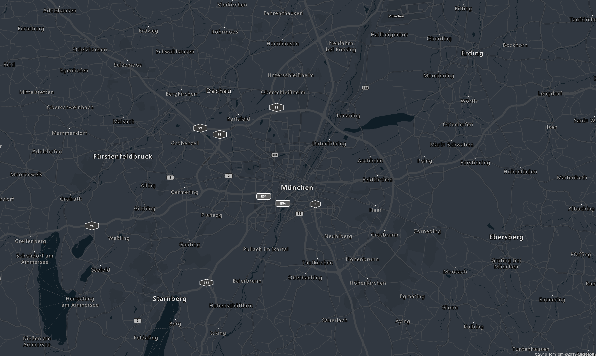
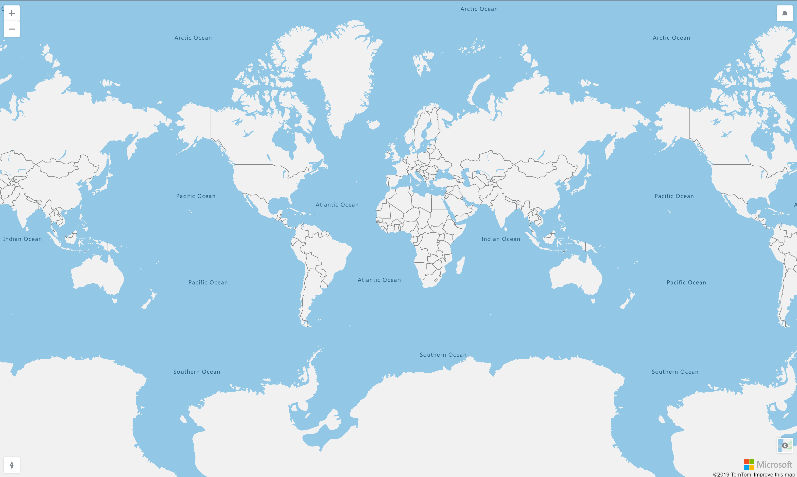
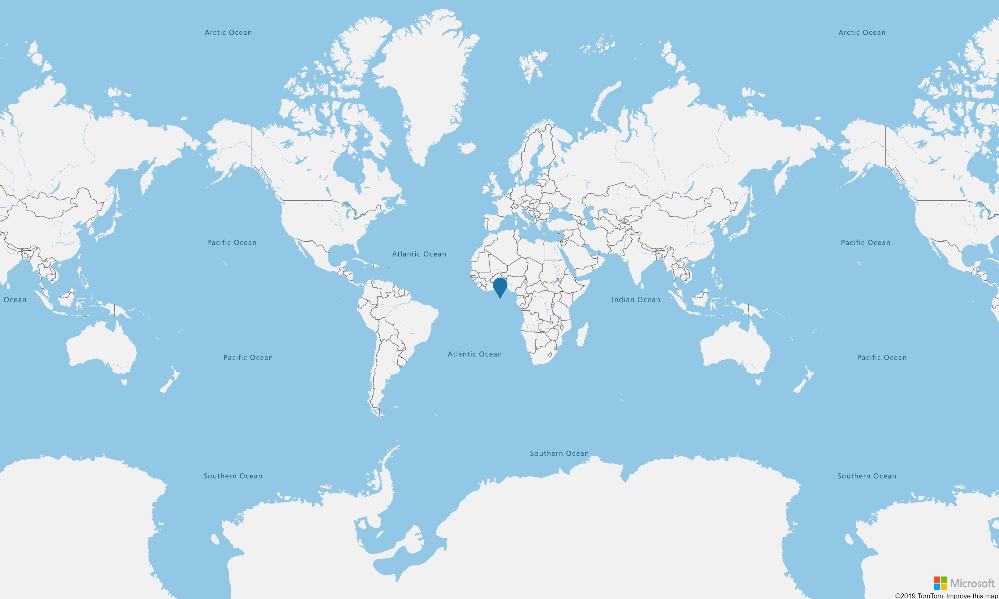

[](https://dev.azure.com/aleclerc/azure-appinsights-api-wrapper/_build/latest?definitionId=6) [](https://www.nuget.org/packages/AzureMapsControl.Components/)

# AzureMapsControl.Components

WIP of Azure Maps Control Razor Components

## Install the Nuget Package

This library is available on Nuget as `AzureMapsControl.Components`.

## Add the css and scripts

You will need to add the atlas script and css files as well as the script generated by the library on your application.

```
@page "/"
@namespace AzureMapsControl.Restore.Pages
@addTagHelper *, Microsoft.AspNetCore.Mvc.TagHelpers
@{
    Layout = null;
}

<!DOCTYPE html>
<html lang="en">
<head>
    <meta charset="utf-8" />
    <meta name="viewport" content="width=device-width, initial-scale=1.0" />
    <title>AzureMapsControl.Sample</title>
    <base href="~/" />
    <link rel="stylesheet" href="https://atlas.microsoft.com/sdk/javascript/mapcontrol/2/atlas.min.css" type="text/css" />
    <style>
        body {
            margin: 0;
        }

        #map {
            position: absolute;
            width: 100%;
            min-width: 290px;
            height: 100%;
        }
    </style>
</head>
<body>
    <app>
        <component type="typeof(App)" render-mode="ServerPrerendered" />
    </app>

    <script src="https://atlas.microsoft.com/sdk/javascript/mapcontrol/2/atlas.min.js"></script>
    <script src="_content/AzureMapsControl.Components/azureMapsControl.js"></script>
    <script src="_framework/blazor.server.js"></script>
</body>
</html>
```

## Register the Components

You will need to pass the authentication information of your `AzureMaps` instance to the library. For now, only the `SubscriptionKey` authentication mode is supported.

```
namespace AzureMapsControl.Restore
{
    using AzureMapsControl.Components;

    using Microsoft.AspNetCore.Builder;
    using Microsoft.AspNetCore.Hosting;
    using Microsoft.Extensions.Configuration;
    using Microsoft.Extensions.DependencyInjection;
    using Microsoft.Extensions.Hosting;

    public class Startup
    {
        public Startup(IConfiguration configuration)
        {
            Configuration = configuration;
        }

        public IConfiguration Configuration { get; }

        // This method gets called by the runtime. Use this method to add services to the container.
        // For more information on how to configure your application, visit https://go.microsoft.com/fwlink/?LinkID=398940
        public void ConfigureServices(IServiceCollection services)
        {
            services.AddRazorPages();
            services.AddServerSideBlazor();
            services.AddAzureMapsControl(configuration => configuration.SubscriptionKey = Configuration["AzureMaps:SubscriptionKey"]);
        }

        // This method gets called by the runtime. Use this method to configure the HTTP request pipeline.
        public void Configure(IApplicationBuilder app, IWebHostEnvironment env)
        {
            if (env.IsDevelopment())
            {
                app.UseDeveloperExceptionPage();
            }
            else
            {
                app.UseExceptionHandler("/Error");
                // The default HSTS value is 30 days. You may want to change this for production scenarios, see https://aka.ms/aspnetcore-hsts.
                app.UseHsts();
            }

            app.UseHttpsRedirection();
            app.UseStaticFiles();

            app.UseRouting();

            app.UseEndpoints(endpoints => {
                endpoints.MapBlazorHub();
                endpoints.MapFallbackToPage("/_Host");
            });
        }
    }
}

```

## Map

You can use the `AzureMap` component to display a map.

```
@page "/"

@using AzureMapsControl.Components.Map
<AzureMap Id="map"
          Center="new AzureMapsControl.Components.Atlas.Position(11.581990, 48.143534)"
          Zoom="10"
          Style="grayscale_dark"
          ShowLogo="false"
          ShowFeedbackLink="false" />
```

 

Different inputs can be specified to customize the map. . Please refer to the [Azure Maps Web SDK Documentation](https://docs.microsoft.com/en-us/azure/azure-maps/map-create) for more information.

### React to map events

The events of the map are exposed as `EventCallback` on the `AzureMap` component. 

```
@page "/"

@using AzureMapsControl.Components.Map
<AzureMap Id="map"
          Center="new AzureMapsControl.Components.Atlas.Position(11.581990, 48.143534)"
          Zoom="10"
          Style="grayscale_dark"
          ShowLogo="false"
          ShowFeedbackLink="false"
          OnReady="@(async (e) => { Console.WriteLine(e.Type); })" />
```

The following events are implemented : 

| Native event key | AzureMap event | Description |
| -- | -- | -- |
| `boxzoomend` | `OnBoxZoomEnd` | Fired when a "box zoom" interaction ends. |
| `boxzoomstart` | `OnBoxZoomStart` | Fired when a "box zoom" interaction starts. | 
| `click` | `OnClick` | Fired when a pointing device is pressed and released at the same point on the map. |
| `contextmenu` | `OnContextMenu` | Fired when the right button of the mouse is clicked. |
| `data` | `OnData` | Fired when any map data loads or changes. |
| `dblclick` | `OnDblClick` | Fired when a pointing device is clicked twice at the same point on the map. |
| `drag` | `OnDrag` | Fired repeatedly during a "drag to pan" interaction on the map, popup, or HTML marker. |
| `dragend` | `OnDragEnd` | Fired when a "drag to pan" interaction ends on the map, popup, or HTML marker. |
| `dragstart` | `OnDragStart` | Fired when a "drag to pan" interaction starts on the map, popup, or HTML marker. |
| `error` | `OnError` | Fired when an error occurs. |
| `idle` | `OnIdle` | <p>Fired after the last frame rendered before the map enters an "idle" state:<ul><li>No camera transitions are in progress.</li><li>All currently requested tiles have loaded.</li><li>All fade/transition animations have completed.</li></ul></p> |
| `layeradded` | `OnLayerAdded` | Fired after a layer has been added to the map |
| `layerremoved` | `OnLayerRemoved` | Fired after a layer has been removed from the map |
| `load` | `OnLoad` | Fired immediately after all necessary resources have been downloaded and the first visually complete rendering of the map has occurred.
| `mousedown` | `OnMouseDown` | Fired when a pointing device is pressed within the map or when on top of an element. |
| `mousemove` | `OnMouseMove` | Fired when a pointing device is moved within the map or an element. |
| `mouseout` | `OnMouseOut` | Fired when a point device leaves the map's canvas our leaves an element. |
| `mouseover` | `OnMouseOver` | Fired when a pointing device is moved over the map or an element. |
| `mouseup` | `OnMouseUp` | Fired when a pointing device is released within the map or when on top of an element. |
| `move` | `OnMove` | Fired repeatedly during an animated transition from one view to another, as the result of either user interaction or methods. |
| `moveend` | `OnMoveEnd` | Fired just after the map completes a transition from one view to another, as the result of either user interaction or methods. |
| `movestart` | `OnMoveStart` | Fired just before the map begins a transition from one view to another, as the result of either user interaction or methods. |
| `pitch` | `OnPitch` | Fired whenever the map's pitch (tilt) changes as the result of either user interaction or methods. |
| `pitchend` | `OnPitchEnd` | Fired immediately after the map's pitch (tilt) finishes changing as the result of either user interaction or methods. |
| `pitchstart` | `OnPitchStart` | Fired whenever the map's pitch (tilt) begins a change as the result of either user interaction or methods. |
| `ready` | `OnReady` | Fired when the minimum required map resources are loaded before the map is ready to be programmatically interacted with. |
| `render` | `OnRender` | <p>Fired whenever the map is drawn to the screen, as the result of:<ul><li>A change to the map's position, zoom, pitch, or bearing.</li><li>A change to the map's style.</li><li>A change to a `DataSource` source.</li><li>The loading of a vector tile, GeoJSON file, glyph, or sprite.</li></ul></p> |
| `resize` | `OnResize` | Fired immediately after the map has been resized. |
| `rotate` | `OnRotate` | Fired repeatedly during a "drag to rotate" interaction. |
| `rotateend` | `OnRotateEnd` | Fired when a "drag to rotate" interaction ends. |
| `rotatestart` | `OnRotateStart` | Fired when a "drag to rotate" interaction starts. |
| `sourceadded` | `OnSourceAdded` | Fired when a DataSource or VectorTileSource is added to the map. |
| `sourcedata` | `OnSourceData` | Fired when one of the map's sources loads or changes, including if a tile belonging to a source loads or changes. |
| `sourceremoved` | `OnSourceRemoved` | Fired when a DataSource or VectorTileSource is removed from the map. |
| `styledata` | `OnStyleData` | Fired when the map's style loads or changes. |
| `styleimagemissing` | `OnStyleImageMissing` | Fired when a layer tries to load an image from the image sprite that doesn't exist |
| `tokenacquired` | `OnTokenAcquired` | Fired when an AAD access token is obtained. |
| `touchcancel` | `OnTouchCancel` | Fired when a touchcancel event occurs within the map. |
| `touchend` | `OnTouchEnd` | Fired when a touchend event occurs within the map. |
| `touchmove` | `OnTouchMove` | Fired when a touchmove event occurs within the map. |
| `touchstart` | `OnTouchStart` | Fired when a touchstart event occurs within the map. |
| `wheel` | `OnWheel` | Fired when a mouse wheel event occurs within the map. |
| `zoom` | `OnZoom` | Fired repeatedly during an animated transition from one zoom level to another, as the result of either user interaction or methods. |
| `zoomend` | `OnZoomEnd` | Fired just after the map completes a transition from one zoom level to another, as the result of either user interaction or methods. |
| `zoomstart` | `OnZoomStart` | Fired just before the map begins a transition from one zoom level to another, as the result of either user interaction or methods. |

### Activate or deactivate events

It is possible and recommended to active only the events you need, or at least deactivate the events which are often triggered in order to avoid overflowing the WebSocket communication between the component and the server application. The `AzureMap` component accepts an `EventActivationFlags` parameter where you can define which events should be triggered by the map.

The following example activates all the events except `Drag`, `Idle`, `MouseMove` and `Render`.

```
@page "/"

@using AzureMapsControl.Components.Map
<AzureMap Id="map"
          Center="new AzureMapsControl.Components.Atlas.Position(11.581990, 48.143534)"
          Zoom="10"
          Style="grayscale_dark"
          ShowLogo="false"
          ShowFeedbackLink="false"
          OnReady="@(async (e) => { Console.WriteLine(e.Type); })"
          EventActivationFlags="MapEventActivationFlags
                                .All
                                .Disable(MapEventType.Drag,
                                    MapEventType.Idle,
                                    MapEventType.MouseMove,
                                    MapEventType.Render)"/>
```

The following example deactivates all the events except `Ready`.

```
@page "/"

@using AzureMapsControl.Components.Map
<AzureMap Id="map"
          Center="new AzureMapsControl.Components.Atlas.Position(11.581990, 48.143534)"
          Zoom="10"
          Style="grayscale_dark"
          ShowLogo="false"
          ShowFeedbackLink="false"
          OnReady="@(async (e) => { Console.WriteLine(e.Type); })"
          EventActivationFlags="MapEventActivationFlags
                                .None
                                .Enable(MapEventType.Ready)"/>
```

## Controls

4 types of controls are available :

- `Compass` : A control for changing the rotation of the map.
- `Pitch` :  A control for changing the pitch of the map.
- `Style`: A control for changing the style of the map.
- `Zoom` : A control for changing the zoom of the map.

There is two ways to add the controls to the map : 

- Using the `Controls` parameter

```
@page "/Controls"

@using AzureMapsControl.Components.Map
<AzureMap Id="map"
          EventActivationFlags="MapEventActivationFlags
                                .All
                                .Disable(MapEventType.Drag,
                                    MapEventType.Idle,
                                    MapEventType.MouseMove,
                                    MapEventType.Render)"
          Controls="new []
          {
                        new Components.Atlas.Control(AzureMapsControl.Components.Atlas.ControlType.Zoom, AzureMapsControl.Components.Atlas.ControlPosition.TopLeft),
            new Components.Atlas.Control(AzureMapsControl.Components.Atlas.ControlType.Pitch, AzureMapsControl.Components.Atlas.ControlPosition.TopRight),
            new Components.Atlas.Control(AzureMapsControl.Components.Atlas.ControlType.Compass, AzureMapsControl.Components.Atlas.ControlPosition.BottomLeft),
            new Components.Atlas.Control(AzureMapsControl.Components.Atlas.ControlType.Style, AzureMapsControl.Components.Atlas.ControlPosition.BottomRight)
          }" />
```

- Or subscribing to the `OnReady` event calling the `AddControlsAsync` method on the map.

```
@page "/ControlsOnReady"

@using AzureMapsControl.Components.Map
<AzureMap Id="map"
          EventActivationFlags="MapEventActivationFlags
                                .All
                                .Disable(MapEventType.Drag,
                                    MapEventType.Idle,
                                    MapEventType.MouseMove,
                                    MapEventType.Render)"
          OnReady="OnMapReady" />

@code  {

    public async Task OnMapReady(MapEventArgs eventArgs)
    {
        await eventArgs.Map.AddControlsAsync
        (
            new Components.Atlas.Control(AzureMapsControl.Components.Atlas.ControlType.Zoom, AzureMapsControl.Components.Atlas.ControlPosition.TopLeft),
            new Components.Atlas.Control(AzureMapsControl.Components.Atlas.ControlType.Pitch, AzureMapsControl.Components.Atlas.ControlPosition.TopRight),
            new Components.Atlas.Control(AzureMapsControl.Components.Atlas.ControlType.Compass, AzureMapsControl.Components.Atlas.ControlPosition.BottomLeft),
            new Components.Atlas.Control(AzureMapsControl.Components.Atlas.ControlType.Style, AzureMapsControl.Components.Atlas.ControlPosition.BottomRight)
        );
    }

}
```

 

## HTML Markers

HTML Markers can be added directly on the map using the `HtmlMarkers` property on the `AzureMap` component.

```
@page "/HtmlMarkers"

@using AzureMapsControl.Components.Map
<AzureMap Id="map"
          EventActivationFlags="MapEventActivationFlags
                                .None
                                .Enable(MapEventType.Ready)"
          HtmlMarkers="new [] {
                           new AzureMapsControl.Components.Markers.HtmlMarker(
                               new Components.Markers.HtmlMarkerOptions
                               {
                                   Position = new Components.Atlas.Position(0, 0),
                                   Draggable = true
                               })
                       }" />
```

They can also be added programmatically using the `AddHtmlMarkersAsync` method available on the Map. The following example adds a marker to the map once it's `ready` event has been triggered.

```
@page "/HtmlMarkersOnReady"

@using AzureMapsControl.Components.Map
<AzureMap Id="map"
          EventActivationFlags="MapEventActivationFlags
                                .None
                                .Enable(MapEventType.Ready)"
          OnReady="OnMapReady"/>

@code  {
    public async Task OnMapReady(MapEventArgs events)
    {
        await events.Map.AddHtmlMarkersAsync
        (
            new AzureMapsControl.Components.Markers.HtmlMarker(
            new Components.Markers.HtmlMarkerOptions
            {
                Position = new Components.Atlas.Position(0, 0),
                Draggable = true
            })
        );
    }
}
```

 

More information concerning the HtmlMarkers can be found on the [Azure Maps Documentation](https://docs.microsoft.com/en-us/azure/azure-maps/map-add-custom-html).

### Enable and disable events

Just like for the `AzureMap`, you can enable or disable events on each HtmlMarker. To do so, you can provide the `HtmlMarkerEventActivationFlags` while creating a new HtmlMarker. The following example adds an `HtmlMarker` with only the `click` event activated.

```
@page "/HtmlMarkers"

@using AzureMapsControl.Components.Map
<AzureMap Id="map"
          EventActivationFlags="MapEventActivationFlags
                                .None
                                .Enable(MapEventType.Ready)"
          OnReady="OnMapReady" />

@code  {

    public async Task OnMapReady(MapEventArgs events)
    {
        var marker = new AzureMapsControl.Components.Markers.HtmlMarker(
            new Components.Markers.HtmlMarkerOptions
            {
                Position = new Components.Atlas.Position(0, 0),
                Draggable = true
            },
            AzureMapsControl.Components.Markers.HtmlMarkerEventActivationFlags.None.Enable(AzureMapsControl.Components.Markers.HtmlMarkerEventType.Click));

        await events.Map.AddHtmlMarkersAsync(marker);
    }
}
```

### React to events on HtmlMarkers

You can subscribe to events on an instance of the `HtmlMarker` class. The following events are supported :

| Native event key | HtmlMarker event | Description |
| -- | -- | -- |
| `click` | `OnClick` | Fired when a pointing device is pressed and released at the same point on the marker. |
| `contextmenu` | `OnContextMenu` | Fired when the right button of the mouse is clicked on the marker. |
| `dblclick` | `OnDbClick` | Fired when a pointing device is clicked twice at the same point on the marker. |
| `drag` | `OnDrag` | Fired repeatedly during a "drag to pan" interaction on the HTML marker. |
| `dragend` | `OnDragEnd` | Fired when a "drag to pan" interaction ends on the HTML marker. |
| `dragstart` | `OnDragStart` | Fired when a "drag to pan" interaction starts on the HTML marker. |
| `keydown` | `OnKeyDown` | Fired when key is pressed down on the HTML marker. |
| `keypress` | `OnKeyPress` | Fired when key is pressed on the HTML marker. |
| `keyup` | `OnKeyUp` | Fired when key is pressed up on the HTML marker. |
| `mousedown` | `OnMouseDown` | Fired when a pointing device is pressed within the HTML marker or when on top of an element. |
| `mouseenter` | `OnMouseEnter` | Fired when a pointing device is initially moved over the HTML marker or an element. |
| `mouseleave` | `OnMouseLeave` | Fired when a pointing device is moved out the HTML marker or an element. |
| `mousemove` | `OnMouseMove` | Fired when a pointing device is moved within the HTML marker or an element. |
| `mouseout` | `OnMouseOut` | Fired when a point device leaves the HTML marker's canvas our leaves an element. |
| `mouseover` | `OnMouseOver` | Fired when a pointing device is moved over the HTML marker or an element. |
| `mouseup` | `OnMouseUp` | Fired when a pointing device is released within the HTML Marker or when on top of an element. |

The following example suscribes to the `click` event on an `HtmlMarker`.

```
@page "/HtmlMarkers"

@using AzureMapsControl.Components.Map
<AzureMap Id="map"
          EventActivationFlags="MapEventActivationFlags
                                .None
                                .Enable(MapEventType.Ready)"
          OnReady="OnMapReady" />

@code  {

    public async Task OnMapReady(MapEventArgs events)
    {
        var marker = new AzureMapsControl.Components.Markers.HtmlMarker(
            new Components.Markers.HtmlMarkerOptions
            {
                Position = new Components.Atlas.Position(0, 0),
                Draggable = true
            },
            AzureMapsControl.Components.Markers.HtmlMarkerEventActivationFlags.None.Enable(AzureMapsControl.Components.Markers.HtmlMarkerEventType.Click));

        marker.OnClick += (args) =>
        {
            //Do something when the marker has been clicked
        };

        await events.Map.AddHtmlMarkersAsync(marker);
    }
}
```

### Update an HtmlMarker

You can update an `HtmlMarker` using the `UpdateHtmlMarkersAsync` method available on the `Map` by giving an `HtmlMarkerUpdate`containing the previously created `HtmlMarker` and the options to update. 

The following updates an `HtmlMarker` by changing its color when the mouse goes over it. 

```
@page "/HtmlMarkers"

@using AzureMapsControl.Components.Map
<AzureMap Id="map"
          EventActivationFlags="MapEventActivationFlags
                                .None
                                .Enable(MapEventType.Ready)"
          OnReady="OnMapReady" />

@code  {
    
    public async Task OnMapReady(MapEventArgs events)
    {
        var markerColor = "#0000FF";
        var overColor = "#FF0000";
        var marker = new AzureMapsControl.Components.Markers.HtmlMarker(
            new Components.Markers.HtmlMarkerOptions
            {
                Position = new Components.Atlas.Position(0, 0),
                Draggable = true,
                Color = markerColor
            },
            AzureMapsControl.Components.Markers.HtmlMarkerEventActivationFlags.None.Enable(
                AzureMapsControl.Components.Markers.HtmlMarkerEventType.MouseEnter, 
                AzureMapsControl.Components.Markers.HtmlMarkerEventType.MouseLeave)
            );


        marker.OnMouseEnter += async (args) =>
        {
            var updatedOptions = new AzureMapsControl.Components.Markers.HtmlMarkerOptions
            {
                Color = overColor
            };

            await args.Map.UpdateHtmlMarkersAsync(new Components.Markers.HtmlMarkerUpdate(marker, updatedOptions));
        };

        marker.OnMouseLeave += async (args) =>
        {
            var updatedOptions = new AzureMapsControl.Components.Markers.HtmlMarkerOptions
            {
                Color = markerColor
            };

            await args.Map.UpdateHtmlMarkersAsync(new Components.Markers.HtmlMarkerUpdate(marker, updatedOptions));
        };

        await events.Map.AddHtmlMarkersAsync(marker);
    }
}
```