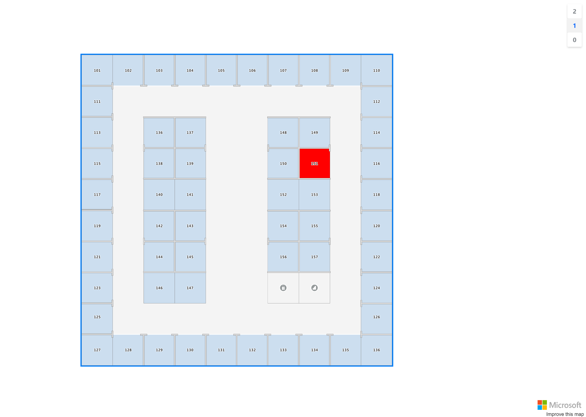

## Indoor Module



You can use the `Azure Maps Indoor module` with this library. The `Azure Maps Indoor module` allows you to render indoor maps created in Azure Maps Creator services (Preview). To use this module, you will need to reference the following css and script in your application : 


```
<link rel="stylesheet" href="https://atlas.microsoft.com/sdk/javascript/indoor/0.1/atlas-indoor.min.css" type="text/css" />
```

```
<script src="https://atlas.microsoft.com/sdk/javascript/indoor/0.1/atlas-indoor.js"></script>
```

### IIndoorService

The entry point is the `IIndoorService` interface. This interface can be injected into your services and Razor Pages and allows you to create an `IndoorManager` via the `CreateIndoorManagerAsync` method.

### IndoorManager

An IndoorManager handles loading the indoor maps styles. Having an instance of `IndoorManager allows you for example to modify the styles of the indoor maps, set the facility and level you want to display or react to events. Following events are supported : 

| Event | Description |
| -- | -- |
| `OnFacilityChanged` | Fired when when the facility changes. |
| `OnLevelChanged` | Fired when when the level changes. |

### Sample

The following sample code is the adaptation of this [sample](https://docs.microsoft.com/en-us/azure/azure-maps/how-to-use-indoor-module#example-use-the-indoor-maps-module).

```
@page "/Indoor"

@using AzureMapsControl.Components.Map
@using Microsoft.Extensions.Configuration

@inject AzureMapsControl.Components.Indoor.IIndoorService IndoorService
@inject IConfiguration Configuration

<AzureMap Id="map"
          CameraOptions="new CameraOptions { Center= new AzureMapsControl.Components.Atlas.Position(-122.13214, 47.63647), Zoom = 19 }"
          StyleOptions="new StyleOptions { Style = MapStyle.Blank }"
          EventActivationFlags="AzureMapsControl.Components.Map.MapEventActivationFlags.None().Enable(AzureMapsControl.Components.Map.MapEventType.Ready, AzureMapsControl.Components.Map.MapEventType.Click)"
          OnReady="OnMapReadyAsync" />

@code {

    public async Task OnMapReadyAsync(MapEventArgs eventArgs)
    {
        var levelControl = new AzureMapsControl.Components.Indoor.LevelControl(new AzureMapsControl.Components.Indoor.LevelControlOptions
        {
            Position = AzureMapsControl.Components.Controls.ControlPosition.TopRight
        });

        var statesetId = Configuration["Indoor:StatesetId"];

        var options = new AzureMapsControl.Components.Indoor.IndoorManagerOptions
        {
            LevelControl = levelControl,
            StatesetId = statesetId,
            TilesetId = Configuration["Indoor:TilesetId"]
        };

        var indoorManager = await IndoorService.CreateIndoorManagerAsync(options, Components.Indoor.IndoorManagerEventActivationFlags.All());

        indoorManager.OnFacilityChanged += eventArgs =>
        {
            Console.WriteLine("OnFacilityChanged");
            Console.WriteLine($"Switched facility from {eventArgs.PrevFacilityId} to {eventArgs.FacilityId}");
            Console.WriteLine($"Switched level from {eventArgs.PrevLevelNumber} to {eventArgs.LevelNumber}");
        };

        indoorManager.OnLevelChanged += eventArgs =>
        {
            Console.WriteLine("OnLevelChanged");
            Console.WriteLine($"Switched facility from {eventArgs.PrevFacilityId} to {eventArgs.FacilityId}");
            Console.WriteLine($"Switched level from {eventArgs.PrevLevelNumber} to {eventArgs.LevelNumber}");
        };

        if (!string.IsNullOrWhiteSpace(statesetId))
        {
            await indoorManager.SetDynamicStylingAsync(true);
        }
    }

}
```