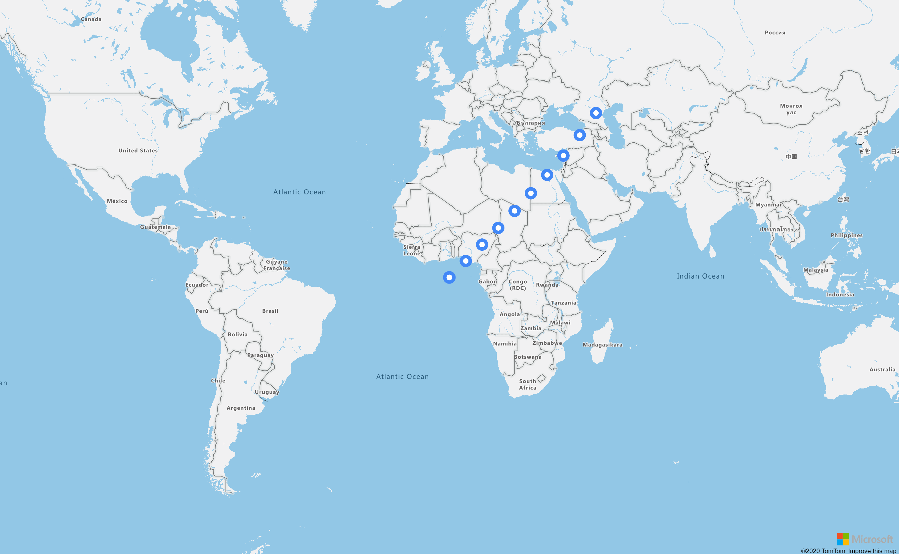

## Bubble Layer

Bubble layers render points as circles on the map with a fixed pixel radius. 



The `Bubble Layer` requires a data source. The ID of the datasource to bind to the layer can be set on the `Source` property of the options of the layer.

```
@page "/BubbleLayerOnReady"

@using AzureMapsControl.Components.Map
<AzureMap Id="map"
          Zoom="2"
          EventActivationFlags="MapEventActivationFlags
                                .None()
                                .Enable(MapEventType.Ready)"
          OnReady="OnMapReady" />

@code  {
    public async Task OnMapReady(MapEventArgs events)
    {
        const string dataSourceId = "bubbleDataSource";
        var dataSource = new AzureMapsControl.Components.Data.DataSource(dataSourceId);
        await events.Map.AddSourceAsync(dataSource);


        var geometries = new List<AzureMapsControl.Components.Atlas.Geometry>();
        for (var i = 0; i < 10; i++)
        {
            geometries.Add(new AzureMapsControl.Components.Atlas.Point(new Components.Atlas.Position(i * 5, i * 5)));
        }

        await dataSource.AddAsync(geometries);

        var layer = new AzureMapsControl.Components.Layers.BubbleLayer
        {
            Options = new Components.Layers.BubbleLayerOptions
            {
                Color = new Components.Atlas.ExpressionOrString("white"),
                Radius = new Components.Atlas.ExpressionOrNumber(5),
                StrokeColor = new Components.Atlas.ExpressionOrString("#4288f7"),
                StrokeWidth = new Components.Atlas.ExpressionOrNumber(6),
                Source = dataSourceId
            }
        };

        await events.Map.AddLayerAsync(layer);
    }
}
```