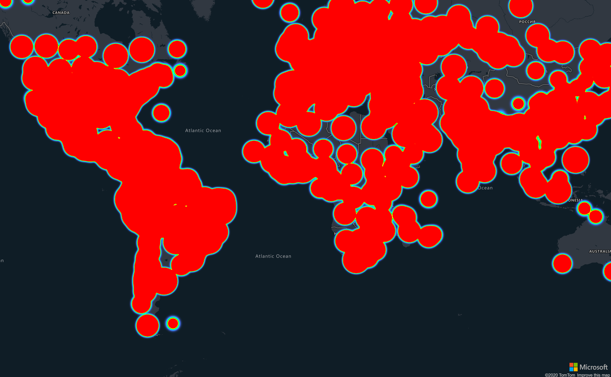

## Heatmap Layer

Heat maps, also known as point density maps, are a type of data visualization. They're used to represent the density of data using a range of colors and show the data "hot spots" on a map. Heat maps are a great way to render datasets with large number of points.



The `Heatmap Layer` requires a data source. The ID of the datasource to bind to the layer can be set on the `Source` property of the options of the layer.

```
@page "/Layers/HeatmapLayerOnReady"

@using AzureMapsControl.Components.Map
<AzureMap Id="map"
          CameraOptions="new CameraOptions { Zoom = 2 }"
          StyleOptions="StyleOptions"
          EventActivationFlags="MapEventActivationFlags
                                .None()
                                .Enable(MapEventType.Ready, MapEventType.SourceAdded)"
          OnReady="OnMapReady"
          OnSourceAdded="OnDatasourceAdded"/>

@code  {

    private readonly string _datasourceId = "heatmapDataSource";

    public StyleOptions StyleOptions = new StyleOptions
    {
        Style = MapStyle.GrayscaleDark
    };

    public async Task OnMapReady(MapEventArgs eventArgs)
    {
        var dataSource = new AzureMapsControl.Components.Data.DataSource(_datasourceId);
        await eventArgs.Map.AddSourceAsync(dataSource);
        await dataSource.ImportDataFromUrlAsync("https://services1.arcgis.com/0MSEUqKaxRlEPj5g/arcgis/rest/services/ncov_cases/FeatureServer/1/query?where=1%3D1&f=geojson&outFields=*");
    }

    public async Task OnDatasourceAdded(MapSourceEventArgs eventArgs)
    {
        var weightExpressionJsonString = "[\"get\", \"Confirmed\"]";

        var layer = new AzureMapsControl.Components.Layers.HeatmapLayer
        {
            Options = new Components.Layers.HeatmapLayerOptions
            {
                Weight = new Components.Atlas.ExpressionOrNumber(System.Text.Json.JsonDocument.Parse(weightExpressionJsonString)),
                Radius = new Components.Atlas.ExpressionOrNumber(20),
                Source = _datasourceId
            }
        };

        await eventArgs.Map.AddLayerAsync(layer);
    }
}
```