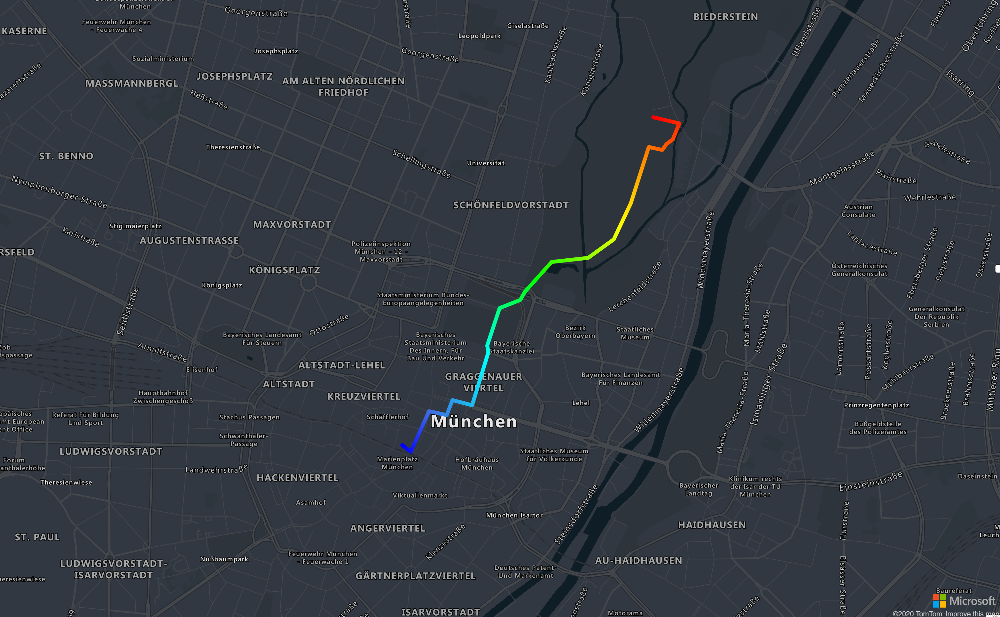

## Line Layer

A line layer can be used to render `LineString` and `MultiLineString` features as paths or routes on the map. A line layer can also be used to render the outline of `Polygon` and `MultiPolygon` features. A data source is connected to a line layer to provide it with data to render.



```
@page "/LineLayerOnReady"

@using AzureMapsControl.Components.Map
<AzureMap Id="map"
          CameraOptions="new CameraOptions { Center = new Components.Atlas.Position(11.581990, 48.143534), Zoom = 14 }"
          StyleOptions="StyleOptions"
          EventActivationFlags="MapEventActivationFlags
                                .None()
                                .Enable(MapEventType.Ready)"
          OnReady="OnMapReady" />

@code  {

    public StyleOptions StyleOptions = new StyleOptions
    {
        Style = MapStyle.GrayscaleDark
    };

    public async Task OnMapReady(MapEventArgs events)
    {
        const string dataSourceId = "dataSource";
        var dataSource = new AzureMapsControl.Components.Data.DataSource(dataSourceId)
        {
            Options = new Components.Data.DataSourceOptions
            {
                LineMetrics = true
            }
        };
        await events.Map.AddSourceAsync(dataSource);

        await dataSource.AddAsync(new AzureMapsControl.Components.Atlas.Shape<AzureMapsControl.Components.Atlas.LineString>(
        new AzureMapsControl.Components.Atlas.LineString(new[] {
            new AzureMapsControl.Components.Atlas.Position(11.575454, 48.137392),
            new AzureMapsControl.Components.Atlas.Position(11.576029, 48.137094),
            new AzureMapsControl.Components.Atlas.Position(11.577248, 48.138912),
            new AzureMapsControl.Components.Atlas.Position(11.578434, 48.138737),
            new AzureMapsControl.Components.Atlas.Position(11.578826, 48.139409),
            new AzureMapsControl.Components.Atlas.Position(11.580140, 48.139179),
            new AzureMapsControl.Components.Atlas.Position(11.581237, 48.141555),
            new AzureMapsControl.Components.Atlas.Position(11.581155, 48.141852),
            new AzureMapsControl.Components.Atlas.Position(11.581990, 48.143534),
            new AzureMapsControl.Components.Atlas.Position(11.583355, 48.143896),
            new AzureMapsControl.Components.Atlas.Position(11.583662, 48.144258),
            new AzureMapsControl.Components.Atlas.Position(11.585458, 48.145596),
            new AzureMapsControl.Components.Atlas.Position(11.587910, 48.145779),
            new AzureMapsControl.Components.Atlas.Position(11.589632, 48.146608),
            new AzureMapsControl.Components.Atlas.Position(11.590771, 48.148219),
            new AzureMapsControl.Components.Atlas.Position(11.591979, 48.150743),
            new AzureMapsControl.Components.Atlas.Position(11.592885, 48.150611),
            new AzureMapsControl.Components.Atlas.Position(11.593161, 48.150874),
            new AzureMapsControl.Components.Atlas.Position(11.593594, 48.151084),
            new AzureMapsControl.Components.Atlas.Position(11.594028, 48.151803),
            new AzureMapsControl.Components.Atlas.Position(11.592281, 48.152074)
        })));

        var layer = new AzureMapsControl.Components.Layers.LineLayer
        {
            Options = new Components.Layers.LineLayerOptions
            {
                Source = dataSourceId,
                StrokeWidth = new Components.Atlas.ExpressionOrNumber(6),
                StrokeGradient = new Components.Atlas.Expression(
                    new AzureMapsControl.Components.Atlas.Expression[]
                    {
                        new AzureMapsControl.Components.Atlas.ExpressionOrString("interpolate"),
                        new Components.Atlas.Expression(
                            new AzureMapsControl.Components.Atlas.Expression[]
                            {
                                new AzureMapsControl.Components.Atlas.ExpressionOrString("linear")
                            }),
                        new Components.Atlas.Expression(
                            new AzureMapsControl.Components.Atlas.Expression[]
                            {
                                new AzureMapsControl.Components.Atlas.ExpressionOrString("line-progress")
                            }),
                        new AzureMapsControl.Components.Atlas.ExpressionOrNumber(0),
                        new AzureMapsControl.Components.Atlas.ExpressionOrString("blue"),
                        new AzureMapsControl.Components.Atlas.ExpressionOrNumber(0.1),
                        new AzureMapsControl.Components.Atlas.ExpressionOrString("royalBlue"),
                        new AzureMapsControl.Components.Atlas.ExpressionOrNumber(0.3),
                        new AzureMapsControl.Components.Atlas.ExpressionOrString("cyan"),
                        new AzureMapsControl.Components.Atlas.ExpressionOrNumber(0.5),
                        new AzureMapsControl.Components.Atlas.ExpressionOrString("lime"),
                        new AzureMapsControl.Components.Atlas.ExpressionOrNumber(0.7),
                        new AzureMapsControl.Components.Atlas.ExpressionOrString("yellow"),
                        new AzureMapsControl.Components.Atlas.ExpressionOrNumber(1),
                        new AzureMapsControl.Components.Atlas.ExpressionOrString("red"),
                    })
            }
        };

        await events.Map.AddLayerAsync(layer);
    }
}
```