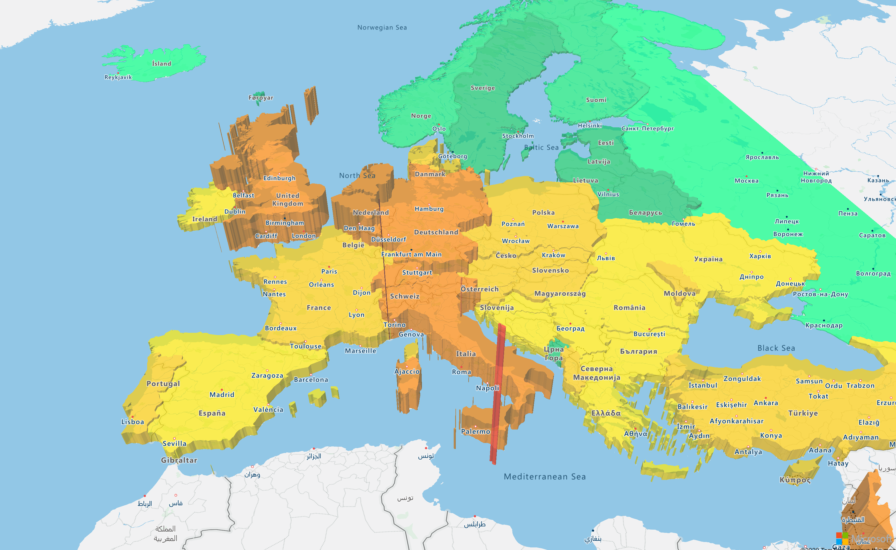

## Polygon Extrusion Layer

The polygon extrusion layer renders areas of `Polygon` and `MultiPolygon` feature geometries as extruded shapes.



```
@page "/PolygonExtrusionLayerOnReady"

@using AzureMapsControl.Components.Map
<AzureMap Id="map"
          CameraOptions="new CameraOptions { Center = new Components.Atlas.Position(11.581990, 48.143534), Zoom = 4, Pitch = 45 }"
          EventActivationFlags="MapEventActivationFlags
                                .None()
                                .Enable(MapEventType.Ready)"
          OnReady="OnMapReady" />

@code  {
    public async Task OnMapReady(MapEventArgs events)
    {
        const string dataSourceId = "dataSource";
        var dataSource = new AzureMapsControl.Components.Data.DataSource(dataSourceId);
        await events.Map.AddSourceAsync(dataSource);

        await dataSource.ImportDataFromUrlAsync("https://raw.githubusercontent.com/arnaudleclerc/ng-azure-maps/main/assets/data/countries.geojson.json");

        var fillColorExpressionJsonString = "[\"step\", [\"get\", \"DENSITY\"], \"#00ff80\", 10, \"#09e076\", 20, \"#0bbf67\", 50, \"#f7e305\", 100, \"#f7c707\", 200, \"#f78205\", 500, \"#f75e05\", 1000, \"#f72505\", 10000, \"#6b0a05\"]";
        var heightExpressionJsonString = "[\"interpolate\", [\"linear\"], [\"get\", \"DENSITY\"], 0, 100, 1200, 960000]";

        var layer = new AzureMapsControl.Components.Layers.PolygonExtrusionLayer
        {
            Options = new Components.Layers.PolygonExtrusionLayerOptions
            {
                Source = dataSourceId,
                Base = new Components.Atlas.ExpressionOrNumber(100),
                FillColor = new Components.Atlas.ExpressionOrString(System.Text.Json.JsonDocument.Parse(fillColorExpressionJsonString)),
                FillOpacity = 0.7,
                Height = new Components.Atlas.ExpressionOrNumber(System.Text.Json.JsonDocument.Parse(heightExpressionJsonString))
            }
        };


        await events.Map.AddLayerAsync(layer, "labels");
    }
}
```