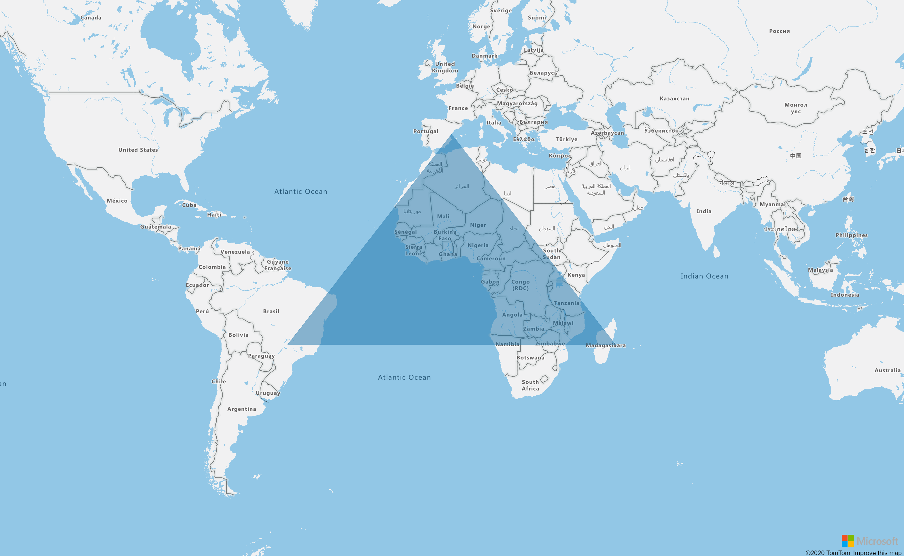

## Polygon Layer

A Polygon Layer renders the areas of `Polygon` and `MultiPolygon` feature geometries on the map using a polygon layer.



```
@page "/Layers/PolygonLayerOnReady"

@using AzureMapsControl.Components.Map
<AzureMap Id="map"
          CameraOptions="new CameraOptions { Zoom = 2 }"
          EventActivationFlags="MapEventActivationFlags
                                .None()
                                .Enable(MapEventType.Ready, MapEventType.SourceAdded)"
          OnReady="OnMapReady"
          OnSourceAdded="OnDatasourceAdded"/>

@code  {

    private readonly string _dataSourceId = "dataSource";

    public async Task OnMapReady(MapEventArgs eventArgs)
    {
        var dataSource = new AzureMapsControl.Components.Data.DataSource(_dataSourceId);
        await eventArgs.Map.AddSourceAsync(dataSource);

        var polygon = new AzureMapsControl.Components.Atlas.Polygon(new[]
        {
    new []
{
        new AzureMapsControl.Components.Atlas.Position(-50, -20),
        new AzureMapsControl.Components.Atlas.Position(0, 40),
        new AzureMapsControl.Components.Atlas.Position(50, -20),
        new AzureMapsControl.Components.Atlas.Position(-50, -20),
    }
    });

        await dataSource.AddAsync(new AzureMapsControl.Components.Atlas.Shape<AzureMapsControl.Components.Atlas.Polygon>(polygon));
    }

    public async Task OnDatasourceAdded(MapEventArgs sourceEventArgs)
    {
        var layer = new AzureMapsControl.Components.Layers.PolygonLayer
        {
            EventActivationFlags = Components.Layers.LayerEventActivationFlags.None().Enable(Components.Layers.LayerEventType.Click),
            Options = new Components.Layers.PolygonLayerOptions
            {
                Source = _dataSourceId,
                FillOpacity = new Components.Atlas.ExpressionOrNumber(0.5),
                FillColor = new Components.Atlas.ExpressionOrString("#1a73aa")
            }
        };

        layer.OnClick += eventArgs =>
        {
            var firstShape = eventArgs.Shapes?.FirstOrDefault();
            if (firstShape != null)
            {
                if (firstShape.Geometry is AzureMapsControl.Components.Atlas.Polygon polygon)
                {
                    foreach (var positions in polygon.Coordinates)
                    {
                        foreach (var position in positions)
                        {
                            Console.WriteLine(position.Longitude);
                            Console.WriteLine(position.Latitude);
                        }
                    }
                }
            }

            var firstFeature = eventArgs.Features?.FirstOrDefault();
            if (firstFeature != null)
            {
                if (firstFeature.Geometry is AzureMapsControl.Components.Atlas.Polygon polygon)
                {
                    foreach (var positions in polygon.Coordinates)
                    {
                        foreach (var position in positions)
                        {
                            Console.WriteLine(position.Longitude);
                            Console.WriteLine(position.Latitude);
                        }
                    }
                }
            }
        };

        await sourceEventArgs.Map.AddLayerAsync(layer);
    }
}
```