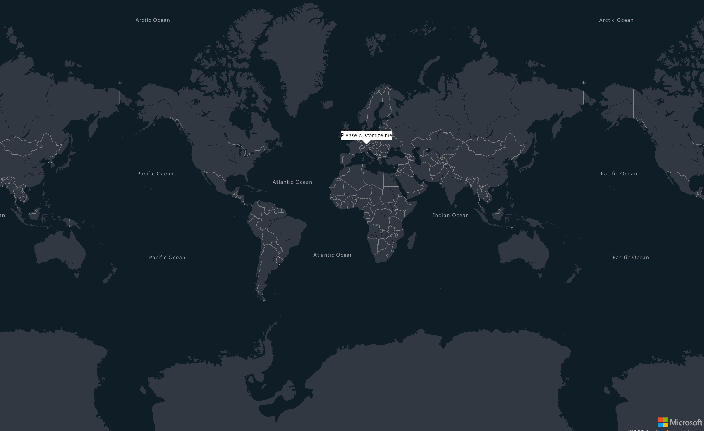

## Popups



Popups can be added to the map using the `AddPopupAsync` method on the map. If the `OpenOnAdd` property is set to true, the popup will be opened once it has been added to the map.

```
@page "/PopupOnReady"

@using AzureMapsControl.Components.Map
<AzureMap Id="map"
          StyleOptions="StyleOptions"
          EventActivationFlags="MapEventActivationFlags
                                .None()
                                .Enable(MapEventType.Ready)"
          OnReady="OnMapReady" />

@code  {

    public StyleOptions StyleOptions = new StyleOptions
    {
        Style = MapStyle.GrayscaleDark
    };

    public async Task OnMapReady(MapEventArgs eventArgs)
    {
        await eventArgs.Map.AddPopupAsync(new Components.Popups.PopupOptions
        {
            CloseButton = false,
            Content = "Please customize me",
            Position = new AzureMapsControl.Components.Atlas.Position(11.581990, 48.143534)
        });
    }

}
```

A popup can also be opened using the `OpenAsync` method.

```
@page "/PopupOnReady"

@using AzureMapsControl.Components.Map
<AzureMap Id="map"
          StyleOptions="StyleOptions"
          EventActivationFlags="MapEventActivationFlags
                                .None()
                                .Enable(MapEventType.Ready)"
          OnReady="OnMapReady" />

@code  {

    public StyleOptions StyleOptions = new StyleOptions
    {
        Style = MapStyle.GrayscaleDark
    };

    public async Task OnMapReady(MapEventArgs eventArgs)
    {
        var popup = new Components.Popups.Popup(new Components.Popups.PopupOptions
        {
            CloseButton = false,
            Content = "Please customize me",
            Position = new AzureMapsControl.Components.Atlas.Position(11.581990, 48.143534)
        });
        await eventArgs.Map.AddPopupAsync(popup);
        await popup.OpenAsync();
    }

}
```

The popup can then be close by calling the `CloseAsync` method.

```
@page "/PopupOnReady"

@using AzureMapsControl.Components.Map
<AzureMap Id="map"
          StyleOptions="StyleOptions"
          EventActivationFlags="MapEventActivationFlags
                                .None()
                                .Enable(MapEventType.Ready)"
          OnReady="OnMapReady" />

@code  {

    public StyleOptions StyleOptions = new StyleOptions
    {
        Style = MapStyle.GrayscaleDark
    };

    public async Task OnMapReady(MapEventArgs eventArgs)
    {
        var popup = new Components.Popups.Popup(new Components.Popups.PopupOptions
        {
            CloseButton = false,
            Content = "Please customize me",
            Position = new AzureMapsControl.Components.Atlas.Position(11.581990, 48.143534)
        });
        await eventArgs.Map.AddPopupAsync(popup);
        await popup.OpenAsync();
        await popup.CloseAsync();
    }

}
```

Calling the `RemoveAsync` method will remove the popup from the map. You can also call the `RemovePopupAsync` method on the map and provide the popup to remove.

```
@page "/PopupOnReady"

@using AzureMapsControl.Components.Map
<AzureMap Id="map"
          StyleOptions="StyleOptions"
          EventActivationFlags="MapEventActivationFlags
                                .None()
                                .Enable(MapEventType.Ready)"
          OnReady="OnMapReady" />

@code  {

    public StyleOptions StyleOptions = new StyleOptions
    {
        Style = MapStyle.GrayscaleDark
    };

    public async Task OnMapReady(MapEventArgs eventArgs)
    {
        var popup = new Components.Popups.Popup(new Components.Popups.PopupOptions
        {
            CloseButton = false,
            Content = "Please customize me",
            Position = new AzureMapsControl.Components.Atlas.Position(11.581990, 48.143534)
        });
        await eventArgs.Map.AddPopupAsync(popup);
        await popup.OpenAsync();

        await popup.RemoveAsync();
    }

}
```

The popup can be updated by calling the `UpdateAsync` method and providing the update to apply on the options. The following example only updates the content of the popup.

```
@page "/PopupOnReady"

@using AzureMapsControl.Components.Map
<AzureMap Id="map"
          StyleOptions="StyleOptions"
          EventActivationFlags="MapEventActivationFlags
                                .None()
                                .Enable(MapEventType.Ready)"
          OnReady="OnMapReady" />

@code  {

    public StyleOptions StyleOptions = new StyleOptions
    {
        Style = MapStyle.GrayscaleDark
    };

    public async Task OnMapReady(MapEventArgs eventArgs)
    {
        var popup = new Components.Popups.Popup(new Components.Popups.PopupOptions
        {
            CloseButton = false,
            Content = "Please customize me",
            Position = new AzureMapsControl.Components.Atlas.Position(11.581990, 48.143534)
        });
        await eventArgs.Map.AddPopupAsync(popup);
        await popup.OpenAsync();

        await popup.UpdateAsync(options => options.Content = "Thanks for updating me");
    }

}
```

All the popups can be cleared using the `ClearPopupsAsync` method on the map.

```
@page "/PopupOnReady"

@using AzureMapsControl.Components.Map
<AzureMap Id="map"
          StyleOptions="StyleOptions"
          EventActivationFlags="MapEventActivationFlags
                                .None()
                                .Enable(MapEventType.Ready)"
          OnReady="OnMapReady" />

@code  {

    public StyleOptions StyleOptions = new StyleOptions
    {
        Style = MapStyle.GrayscaleDark
    };

    public async Task OnMapReady(MapEventArgs eventArgs)
    {
        var popup = new Components.Popups.Popup(new Components.Popups.PopupOptions
        {
            CloseButton = false,
            Content = "Please customize me",
            Position = new AzureMapsControl.Components.Atlas.Position(11.581990, 48.143534)
        });
        await eventArgs.Map.AddPopupAsync(popup);
        await popup.OpenAsync();

        await popup.UpdateAsync(options => options.Content = "Thanks for updating me");
        await eventArgs.Map.ClearPopupsAsync();
    }

}
```

### Events

You can subscribe to events triggered on the popup by defining the `EventActivationFlags` and subscribing to the corresponding event on the `Popup`. 

The following events are available : `Open`, `DragStart`, `DragEnd`, `Drag` and `Close`.

The following example reacts to the opening of a popup : 

```
@page "/PopupOnReady"

@using AzureMapsControl.Components.Map
<AzureMap Id="map"
          StyleOptions="StyleOptions"
          EventActivationFlags="MapEventActivationFlags
                                .None()
                                .Enable(MapEventType.Ready)"
          OnReady="OnMapReady" />

@code  {

    public StyleOptions StyleOptions = new StyleOptions
    {
        Style = MapStyle.GrayscaleDark
    };

    public async Task OnMapReady(MapEventArgs eventArgs)
    {
        var popup = new Components.Popups.Popup(new Components.Popups.PopupOptions
        {
            CloseButton = false,
            Content = "Please customize me",
            Position = new AzureMapsControl.Components.Atlas.Position(11.581990, 48.143534)
        }, AzureMapsControl.Components.Popups.PopupEventActivationFlags.None().Enable(AzureMapsControl.Components.Popups.PopupEventType.Open));

        popup.OnOpen += eventArgs =>
        {
            Console.WriteLine("Popup opened");
        };

        await eventArgs.Map.AddPopupAsync(popup);
        await popup.OpenAsync();
    }

}
```